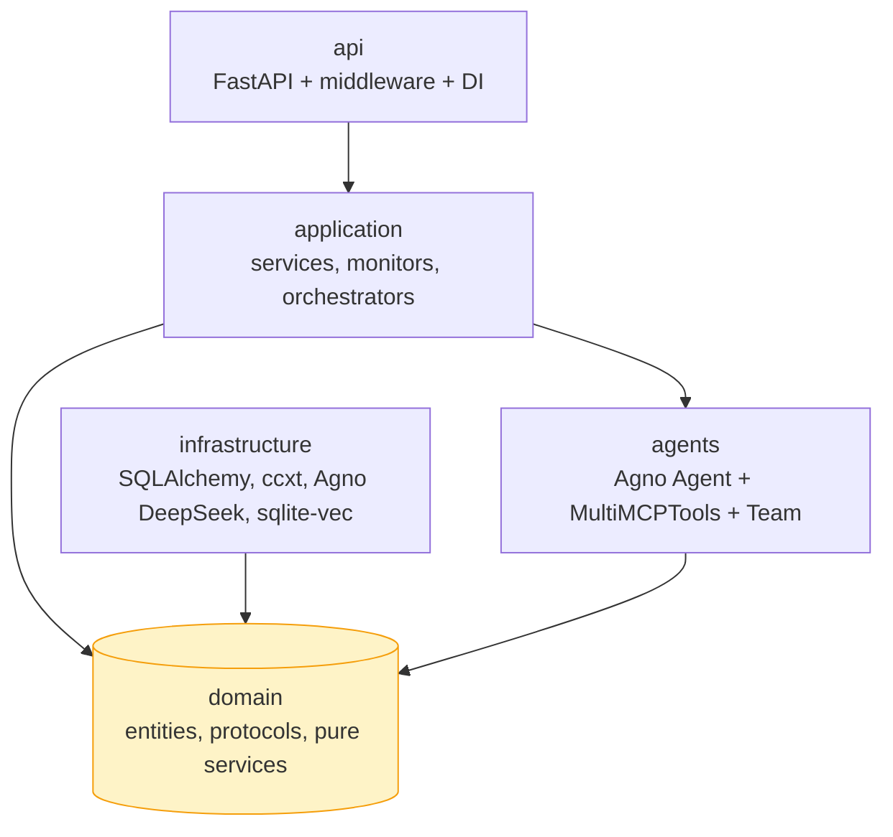
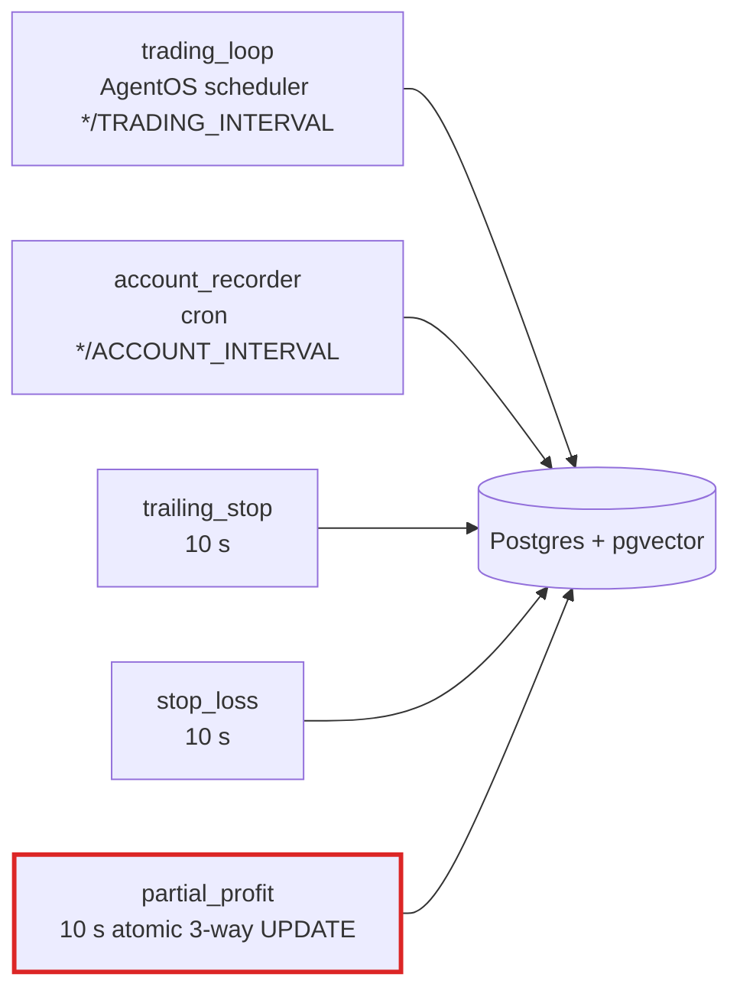

<p align="center">
  <b>English</b> | <a href="README_ZH.md">简体中文</a>
</p>


<h1 align="center">OmniTrade: LLM-Driven Crypto Futures Arena</h1>

<p align="center">
  <b>11 competing strategies · 4 close-path taxonomy · atomic three-way state · real-time dashboard</b>
</p>

<p align="center">
  
  
  
  
  <a href="LICENSE"></a>
  <br>
  
  
  
  
  
</p>

<p align="center">
  <a href="#-key-features">Features</a> &nbsp;&middot;&nbsp;
  <a href="#-what-is-omnitrade">What Is It</a> &nbsp;&middot;&nbsp;
  <a href="#-strategies">Strategies</a> &nbsp;&middot;&nbsp;
  <a href="#-get-started">Get Started</a> &nbsp;&middot;&nbsp;
  <a href="#-architecture">Architecture</a> &nbsp;&middot;&nbsp;
  <a href="#-environment">Env</a> &nbsp;&middot;&nbsp;
  <a href="#-api-reference">API</a> &nbsp;&middot;&nbsp;
  <a href="#-roadmap">Roadmap</a> &nbsp;&middot;&nbsp;
  <a href="#-license">License</a>
</p>

---

## 📢 Project Status

OmniTrade is **actively developed**. The architecture, API surface, and
strategies all evolve in response to operator feedback — issues and
feature requests are very welcome and treated as first-class signal.

If anything breaks, feels off, or you'd like to see a new strategy /
data source / dashboard panel, please [open an issue][issues] or a
pull request — see [CONTRIBUTING.md](CONTRIBUTING.md) for the workflow
and [SECURITY.md](SECURITY.md) for vulnerability reports (private
channel only). Star the repo if you'd like to follow along.

[issues]: https://github.com/yifu/llmtrading/issues

---

## ⚠️ Risk Disclaimer — please read before running

OmniTrade automates real trades on cryptocurrency exchanges. Crypto
derivatives are high-leverage instruments and can cost you the entire
balance of an account in a single bad cycle. This project is research
software released under the MIT license, with **no warranty of any kind**.
The maintainers are not financial advisors and accept no liability for
any losses incurred from running it.

By using this software you accept that:

- **You are responsible for every trade it places.** The agent will open,
  size, and close positions autonomously. Treat its decisions as your
  own.
- **Start on testnet.** `GATE_USE_TESTNET=true` and `OKX_USE_TESTNET=true`
  are the defaults. Run for weeks on testnet before flipping either flag.
- **Start small on mainnet.** When you do go live, begin with a balance
  you would be willing to lose entirely. The HITL gate
  (`HITL_OPEN_SIZE_THRESHOLD_USD`, default $10 000) is a safety net, not
  a substitute for setting your own position-size limits.
- **Lock down your exchange API keys.** Set them to "trade only, no
  withdraw" on Gate.io / OKX. Enable 2FA on the exchange account.
- **Monitor it.** The dashboard exposes every cycle's reasoning,
  positions, and gates. Read it. The G5 fault-phrase scanner flags
  obvious problems automatically; subtler issues are still your call.
- **You bear full regulatory risk.** Algorithmic trading of crypto
  derivatives may be restricted or prohibited in your jurisdiction —
  verify your local rules before running this software.

If you can't accept those terms, stop here.

---

## 💡 What Is OmniTrade?

OmniTrade is an autonomous **crypto-futures trading arena** where 11 LLM-driven strategies compete for PnL on Gate.io or OKX perpetuals. Point it at a testnet, pick a strategy, and watch the agent reason about markets, size positions, and manage risk — with every decision verifiable via a structured output contract test suite.

### Key Capabilities

- **11 named strategies** — from `arena-guardian` (capital-preservation) through `arena-raider-squad` (multi-agent attack team) to `arena-autopilot` (fully autonomous LLM)
- **4-path close-path taxonomy** — `stop_loss`, `trailing_stop`, `partial_profit`, `ai_decision`, plus `none`; enforced by a pure classifier and three 10-second monitors
- **Atomic three-way state contract** — `cumulative_close_pct`, `stop_loss`, `trailing_peak_pnl_pct` land in a single SQL `UPDATE` so the stop-loss monitor can never read a torn write
- **Testnet by default** — `GATE_USE_TESTNET=true` / `OKX_USE_TESTNET=true` out of the box; live trading requires explicit override
- **Characterization gate** — 22 frozen fixtures replay deterministically at ≥ 0.95 Decision-equivalent pass rate
- **Real-time dashboard** — Next.js 14 App Router + SWR + Server-Sent Events (EventSource) with exponential-backoff reconnect

---

## ✨ Key Features

<table width="100%">
  <tr>
    <td align="center" width="25%" valign="top">
      <h3>🎯 Strategy Arena</h3>
      <br><br>
      <div align="left">
        • 11 named strategies across 3 risk profiles<br>
        • 2 prompt branches: minimal (autopilot / dual-signal) vs full "World-class Trader"<br>
        • Per-strategy leverage bands, trailing ladder, partial-profit stages<br>
        • Multi-agent modes: <code>arena-tribunal</code> (3-expert jury) &amp; <code>arena-raider-squad</code> (4-expert team)
      </div>
    </td>
    <td align="center" width="25%" valign="top">
      <h3>🛡️ Close-Path Classifier</h3>
      <br><br>
      <div align="left">
        • Pure classifier: <code>close_path_classifier.py</code><br>
        • 10-s monitors: trailing-stop, stop-loss, partial-profit<br>
        • AI closes via <code>close_position</code> / <code>partial_close</code> tools<br>
        • Three-way state written atomically on every close
      </div>
    </td>
    <td align="center" width="25%" valign="top">
      <h3>🔌 Exchange Client</h3>
      <br><br>
      <div align="left">
        • ccxt unified adapter; testnet default<br>
        • REST: ticker, OHLCV, order book, open interest, funding<br>
        • Real-time dashboard via Server-Sent Events (single transport)<br>
        • Order lifecycle: open, close, partial close, cancel
      </div>
    </td>
    <td align="center" width="25%" valign="top">
      <h3>🧪 Characterization Gate</h3>
      <br><br>
      <div align="left">
        • 22 hand-curated decision contracts<br>
        • VCR cassettes synthesised deterministically<br>
        • Decision-equivalent replay ≥ 0.95 pass-rate<br>
        • Every close-path bucket ≥ 0.95, drift ≤ 0.05
      </div>
    </td>
  </tr>
</table>

---

## 🎯 Strategies

11 strategies, each a concrete configuration of **leverage band → trailing ladder → partial-profit stages → stop-loss override → system-prompt branch**.

| # | Enum value | Profile | Prompt branch | Code-level protection | Frozen fixtures |
|---|---|---|---|---|---|
| 1 | `arena-guardian` | capital-preservation | full | off | `case_06`, `case_19` |
| 2 | `arena-steward` | balanced default | full | off | `case_05`, `case_11`, `case_18` |
| 3 | `arena-raider` | high-leverage single-agent | full | off | `case_07` |
| 4 | `arena-raider-squad` | multi-agent attack team (4 experts) | team | off | `case_16` |
| 5 | `arena-scalper` | 5-minute intraday | full | off | `case_04`, `case_08`, `case_09`, `case_17` |
| 6 | `arena-swingsmith` | multi-day swing | full | **on** (auto-close) | `case_01`-`03`, `case_10`, `case_22` |
| 7 | `arena-strider` | slow trend follower | full | off | `case_20` |
| 8 | `arena-rebate-hunter` | high-frequency rebate arbitrage | full | **on** | `case_12` |
| 9 | `arena-autopilot` | fully autonomous LLM | **minimal** | **on** + AI override | `case_13`, `case_14` |
| 10 | `arena-tribunal` | 3-expert jury consensus | jury | off | `case_21` |
| 11 | `arena-dual-signal` | registry fallback (unknown → dual-signal) | **minimal** | off | `case_15` |

Full parameter tables: [docs/STRATEGIES.md](./docs/STRATEGIES.md).

---

## 🛡️ Close-Path Taxonomy

Four mutually-exclusive close paths plus a `none` bucket. Monitors own the first three; the think-node owns `ai_decision`.

| Path | Driven by | Writes |
|---|---|---|
| `stop_loss` | `stop_loss_monitor` (10 s) | `trades(type=close)`, `agent_decisions(trigger=stop_loss)`, delete positions |
| `trailing_stop` | `trailing_stop_monitor` (10 s, when `enable_code_level_protection`) | `trades`, `agent_decisions`, delete positions |
| `partial_profit` | `partial_profit_monitor` (10 s) | partial `trades`, atomic 3-way `UPDATE positions`, `agent_decisions` |
| `ai_decision` | `close_position` / `partial_close` tools (trading loop) | `trades`, atomic three-way `UPDATE positions` |
| `none` | — | open-only or hold snapshots |

Full rules + truth table: [`apps/backend/src/omnitrade/domain/services/close_path_classifier.py`](./apps/backend/src/omnitrade/domain/services/close_path_classifier.py).

---

## 🚀 Get Started

### Path A · Docker (zero setup)

```bash
cp apps/backend/.env.example .env
# edit .env — set LLM_API_KEY (DeepSeek), GATE_API_KEY / OKX_API_KEY, leave testnet flags ON
docker compose up -d
# `db-init` runs `alembic upgrade head` automatically and the backend
# waits on `service_completed_successfully` before starting.
```

Verify the cycle is running end-to-end:

```bash
curl -X POST http://localhost:8000/api/v1/cycle/trigger          # should return {"status":"ok"} in ≤60s
curl -s 'http://localhost:8000/api/v1/decisions?limit=1' | jq    # last decision JSON
```

| URL | Surface |
|---|---|
| `http://localhost:3000/dashboard` | Next.js dashboard |
| `http://localhost:8000/docs` | FastAPI interactive docs |
| `http://localhost:8000/sse/stream` | Server-Sent Events feed (decision / position / run-paused) |

### Path B · Local (Python 3.11 + Node 20)

```bash
# Backend
cd apps/backend
uv sync --all-extras
uv run alembic upgrade head
uv run uvicorn omnitrade.api.app:create_app --factory --reload

# Frontend (separate terminal)
cd apps/frontend
npm install
npm run dev
```

### Path C · Production

```bash
cp .env.production.example .env.production
# fill secrets — NEVER commit .env.production
docker compose -f docker-compose.prod.yml up -d
```

Full release checklist (smoke tests, observability, rollback plan): [docs/RELEASE_CHECKLIST.md](./docs/RELEASE_CHECKLIST.md).

### Prerequisites

- **LLM API key** — DeepSeek (default `deepseek-reasoner`; switch to `deepseek-v4-pro` / `-flash` via `AGNO_LLM_MODEL`), driven directly by Agno's DeepSeek model class
- **Exchange credentials** — Gate.io or OKX; **testnet recommended**
- Python 3.11+ with [`uv`](https://github.com/astral-sh/uv) for Path B
- Docker + Docker Compose for Paths A / C

---

## 🧠 Environment

All config is env-driven — see [`apps/backend/.env.example`](./apps/backend/.env.example) (dev) and [`.env.production.example`](./.env.production.example) (prod).

| Variable | Default | Description |
|---|---|---|
| `TRADING_STRATEGY` | `arena-autopilot` | one of 11 strategies |
| `TRADING_INTERVAL_MINUTES` | `20` | cron for the main trading loop |
| `MAX_LEVERAGE` | `25` | hard cap per position |
| `MAX_POSITIONS` | `5` | concurrent open positions |
| `MAX_HOLDING_HOURS` | `36` | force-close after this many hours |
| `EXTREME_STOP_LOSS_PERCENT` | `-30` | hard floor — force-close below this PnL % |
| `EXCHANGE` | `gate` | `gate` or `okx` |
| `GATE_USE_TESTNET` / `OKX_USE_TESTNET` | `true` | **testnet default — live trading requires `false`** |
| `LLM_PROVIDER` | `deepseek` | Agno DeepSeek provider key |
| `LLM_MODEL_NAME` | `deepseek/deepseek-v3.2-exp` | any OpenAI-compatible model |
| `MULTI_AGENT_ENABLED` | `false` | enable `arena-raider-squad` / `arena-tribunal` dispatch |
| `FEE_REBATE_PERCENT` | `20` | shown as `rebateAmount` in `/api/account` |

Full list (40+ variables): [`apps/backend/.env.example`](./apps/backend/.env.example).

### Recommended LLMs

OmniTrade is a **tool-calling-heavy** agent — open/close/partial decisions all flow through OpenAI-style tool calls. Model choice directly decides whether the agent *uses* its tools or fabricates decisions.

| Tier | Examples | When to use |
|---|---|---|
| **Best** | `anthropic/claude-sonnet-4.6`, `openai/gpt-5.4`, `google/gemini-3.1-pro` | Multi-agent swarms (`arena-raider-squad`, `arena-tribunal`), long-running research |
| **Sweet spot** (default) | `deepseek/deepseek-v3.2-exp`, `x-ai/grok-4`, `z-ai/glm-5`, `moonshotai/kimi-k2`, `qwen3-max` | Daily driver — reliable tool-calling at ~1/10 the cost |
| **Avoid** | `*-nano`, `*-flash-lite`, small distilled variants | Tool-calling is unreliable; agent will "answer from memory" instead of querying markets |

---

## 🏛️ Architecture

Classic DDD 4-layer + `agents/`, with monitors carved out as the only layer that composes `domain/` + `infrastructure/` directly (atomicity waiver).



Five async loops, all driven by a single injected `Clock` protocol:



Deep-dive: [docs/ARCHITECTURE.md](./docs/ARCHITECTURE.md).

---

## 🌐 API Reference

```bash
uv run uvicorn omnitrade.api.app:create_app --factory
# or: docker compose exec backend ...
```

| Method | Endpoint | Description |
|---|---|---|
| `GET` | `/api/health` · `/api/ready` | liveness / readiness probes |
| `GET` | `/api/account` | balance + rolling 24 h rebate trace |
| `GET` | `/api/positions` | open positions with three-way state |
| `GET` | `/api/trades` | trade history |
| `GET` | `/api/decisions` | agent decision audit log |
| `GET` | `/api/history` | account-value time series |
| `GET` | `/api/stats` | Sharpe, drawdown, strategy breakdown |
| `GET` | `/api/prices` | cached tickers |
| `GET` | `/api/strategy` · `/api/config` | active strategy + runtime knobs |
| `GET` | `/api/rebate` | 24 h rebate summary |
| `GET` | `/api/logs` | in-memory log buffer (tailable) |
| `POST` | `/api/actions/close-all` | emergency close-all (guarded) |
| `POST` | `/api/v1/cycle/trigger` | trigger one trading cycle synchronously |
| `POST` | `/api/v1/runs/{run_id}/confirm` · `/reject` | T9 HITL approve / reject a paused large open |
| `GET` | `/sse/stream` | Server-Sent Events feed (`decision_update`, `position_update`, `run_paused`, `orchestrator_error`, …) |
| `GET` | `/traces` | AgentOS-served OTel span tree per cycle (T4) |

The same routes are also reachable under the `/api/v1/*` prefix; the
unprefixed `/api/*` surface is the Phase-8 legacy mount and is kept for
the dashboard's existing fetch URLs.

Interactive docs: `http://localhost:8000/docs`.

---

## 🗂️ Project Structure

```
llmtrading/
├── apps/
│   ├── backend/                      # Python 3.11 + FastAPI + SQLAlchemy 2.0
│   │   ├── src/omnitrade/
│   │   │   ├── domain/               # entities, protocols, pure services
│   │   │   ├── application/          # services, 5 monitors, multi-agent
│   │   │   ├── infrastructure/       # SQLAlchemy, ccxt, Agno DeepSeek, SSE
│   │   │   ├── agents/               # Agno Agent + MultiMCPTools, prompts
│   │   │   └── api/                  # FastAPI routers + middleware
│   │   ├── alembic/                  # migrations (0001 init, 0002 rename)
│   │   └── tests/                    # structured output + integration tests
│   └── frontend/                     # Next.js 14 + SWR + Server-Sent Events
├── tests/fixtures/frozen/            # 22 hand-curated decision contracts
├── docs/                             # architecture, strategies, release, ...
├── scripts/                          # ops + drift-detection probes
└── docker-compose.yml                # postgres + pgvector + db-init + backend + frontend
```

---

## 🛤️ Roadmap

| Phase | Scope | Status |
|---|---|---|
| 0-7 | DDD port, monitors, dashboard, observability | ✅ shipped |
| 8.x | Port-boundary stubs, multi-timeframe, LLM tools, multi-agent orchestrator, WebSocket market stream | ✅ shipped (WS replaced by SSE in Agno cutover) |
| 9.x | Zero-share rebrand (strategy names, schema columns, fixture IDs, brand sentinel) | ✅ shipped |
| 10.x | License inventory, provenance audit, history scrub | ✅ shipped |
| 11 | Postgres + Decimal/Numeric precision, observability events, per-strategy sub-agent cassettes | 📋 planned |

---

## 🤝 Contributing

Issues and PRs welcome. Please:

1. Run `uv run pytest` inside `apps/backend` — the **702-test suite must stay green**, and the 22 frozen fixtures must replay at ≥ 0.95.
2. The Agno cutover (Stages A–E, see `docs/AGNO_MIGRATION_TRACKER.md`) removed every LangGraph / LangChain / LiteLLM / mcp2py / WebSocket consumer — keep them out of new code.
3. Respect the **three-way state atomicity** — any code path that writes a position's `cumulative_close_pct`, `stop_loss`, or `trailing_peak_pnl_pct` must go through `PositionRepository.apply_three_way_state`.
4. Keep new dependencies within the allow-list (MIT / Apache-2.0 / BSD / ISC / MPL-2.0). See [docs/LICENSE_INVENTORY.md](./docs/LICENSE_INVENTORY.md).

---

## 📄 License

MIT — see [LICENSE](./LICENSE).

---

## ⚠️ Disclaimer

Testnet is the default and the recommended mode. Live trading on mainnet carries a real risk of total loss of funds. The maintainers are **not financial advisors**; nothing in this repository constitutes financial advice. Use at your own risk.

---

## 🙏 Acknowledgments — built on the shoulders of these projects

OmniTrade only exists because of the open-source ecosystem around it.
Huge thanks to the maintainers of every project below — please go star
their repos:

**Agent runtime**
- [**Agno**](https://github.com/agno-agi/agno) — the Agent / Team / Workflow / AgentOS layer that drives every cycle. Single source of truth after the cutover.
- [**FastMCP**](https://github.com/jlowin/fastmcp) — the MCP server framework powering the 9 trading + 6 crypto-data tools.
- [**OpenInference**](https://github.com/Arize-ai/openinference) — the `AgnoInstrumentor` that turns Agno run / model / tool calls into OpenTelemetry spans.
- [**OpenTelemetry**](https://github.com/open-telemetry) — the tracing API + SDK behind `GET /traces`.

**LLM + embeddings**
- [**DeepSeek**](https://www.deepseek.com/) — the default chat model (`deepseek-v4-pro` / `-flash` / `-reasoner`) — fast, cheap, reliable tool-calling.
- [**fastembed**](https://github.com/qdrant/fastembed) + [**BAAI/bge-small-en-v1.5**](https://huggingface.co/BAAI/bge-small-en-v1.5) — local 384-dim embedder for the trade-journal RAG.
- [**hf-mirror.com**](https://hf-mirror.com/) — community-run HuggingFace mirror that makes fastembed reachable on cn networks.

**Backend**
- [**FastAPI**](https://github.com/fastapi/fastapi) + [**Uvicorn**](https://github.com/encode/uvicorn) — the HTTP / SSE surface.
- [**SQLAlchemy**](https://github.com/sqlalchemy/sqlalchemy) + [**Alembic**](https://github.com/sqlalchemy/alembic) — async ORM + migrations.
- [**Postgres**](https://www.postgresql.org/) + [**pgvector**](https://github.com/pgvector/pgvector) — primary store + vector index for the trade-journal Knowledge layer.
- [**psycopg**](https://github.com/psycopg/psycopg) (3.x) — single sync+async driver routed through SQLAlchemy.
- [**APScheduler**](https://github.com/agronholm/apscheduler) — drives the 6 fast position-protection monitors at 10s cadence.
- [**ccxt**](https://github.com/ccxt/ccxt) — unified Gate.io / OKX adapter.
- [**structlog**](https://github.com/hynek/structlog) — the structured-JSON logging layer with secret-stripping processors.
- [**pydantic**](https://github.com/pydantic/pydantic) + [**pydantic-settings**](https://github.com/pydantic/pydantic-settings) — config + every schema in `domain/`.

**Frontend**
- [**Next.js 14**](https://github.com/vercel/next.js) — App Router dashboard.
- [**React**](https://github.com/facebook/react) — UI runtime.
- [**Tailwind CSS**](https://github.com/tailwindlabs/tailwindcss) — design system.
- [**Recharts**](https://github.com/recharts/recharts) — the equity-curve & confidence-gauge charts.
- [**SWR**](https://github.com/vercel/swr) — data fetching for non-streaming endpoints.

**Tooling**
- [**uv**](https://github.com/astral-sh/uv) — Python package manager (10-100× faster than pip).
- [**Ruff**](https://github.com/astral-sh/ruff) — lint + format.
- [**pytest**](https://github.com/pytest-dev/pytest) + [**vcrpy**](https://github.com/kevin1024/vcrpy) — test runner + cassette-based HTTP record/replay.
- [**vitest**](https://github.com/vitest-dev/vitest) + [**Playwright**](https://github.com/microsoft/playwright) — frontend unit + E2E tests.
- [**Docker**](https://www.docker.com/) / [**OrbStack**](https://orbstack.dev/) — local stack runtime.

**Crypto data sources** — read-only, free or freemium:
[CoinGecko](https://www.coingecko.com/), [Alternative.me Fear & Greed](https://alternative.me/crypto/fear-and-greed-index/), [Whale Alert](https://whale-alert.io/), [Coinglass](https://www.coinglass.com/), [LunarCrush](https://lunarcrush.com/), [Etherscan](https://etherscan.io/), [Gate MCP News](https://api.gatemcp.ai/mcp/news).

If we missed your project, please [open an issue][issues] and we'll add
you in.
