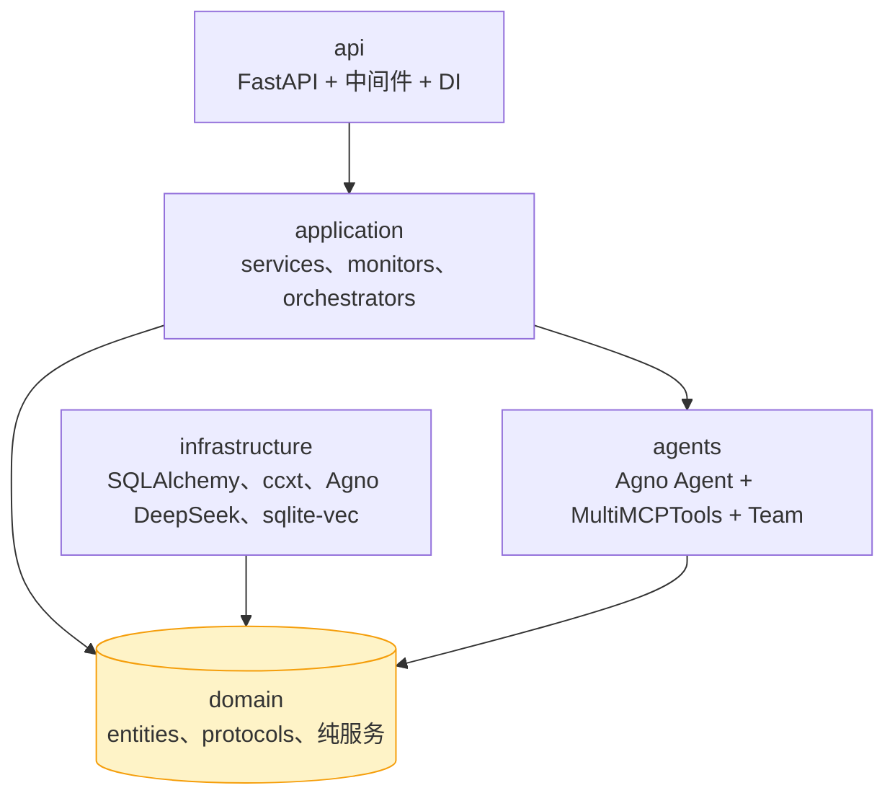
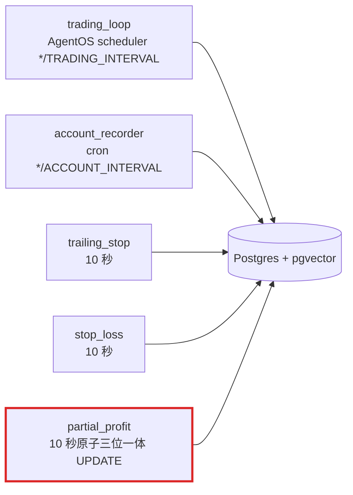

<p align="center">
  <a href="README.md">English</a> | <b>简体中文</b>
</p>

<p align="center">
  <a href="https://github.com/gong1414/omnitrade"></a>
</p>

<h1 align="center">OmniTrade：大模型驱动的合约竞技场</h1>

<p align="center">
  <b>11 套策略同场竞技 · 4 条 close-path 分类 · 三位一体原子状态 · 实时仪表盘</b>
</p>

<p align="center">
  
  
  
  
  <a href="LICENSE"></a>
  <br>
  
  
  
  
  
  <br>
  <a href="https://github.com/gong1414/omnitrade/stargazers"></a>
  <a href="https://github.com/gong1414/omnitrade/network/members"></a>
  <a href="https://github.com/gong1414/omnitrade/issues"></a>
  <a href="https://github.com/gong1414/omnitrade/releases/latest"></a>
  <a href="https://github.com/gong1414/omnitrade/commits/main"></a>
</p>

<p align="center">
  <a href="#-项目简介">简介</a> &nbsp;&middot;&nbsp;
  <a href="#-核心特性">特性</a> &nbsp;&middot;&nbsp;
  <a href="#-11-套策略">策略</a> &nbsp;&middot;&nbsp;
  <a href="#-快速开始">快速开始</a> &nbsp;&middot;&nbsp;
  <a href="#-架构">架构</a> &nbsp;&middot;&nbsp;
  <a href="#-环境变量">环境</a> &nbsp;&middot;&nbsp;
  <a href="#-api-端点">API</a> &nbsp;&middot;&nbsp;
  <a href="#-路线图">路线图</a> &nbsp;&middot;&nbsp;
  <a href="#-许可证">许可证</a>
</p>

---

## 📢 项目状态

OmniTrade **持续开发中**。架构、API、策略都会随着实际运营反馈不断演进——
欢迎随时提 issue 与新需求，每一条都会被认真当回事。

如果你遇到任何问题、觉得哪里不顺手，或者想要某个新策略 / 数据源 / 仪表盘
组件，请直接 [开 issue][issues] 或 PR——具体协作流程见
[CONTRIBUTING.md](CONTRIBUTING.md)，安全漏洞请走
[SECURITY.md](SECURITY.md) 的私有上报通道。觉得项目有用的话，欢迎点
Star 关注后续进展。

[issues]: https://github.com/gong1414/omnitrade/issues

---

## ⚠️ 风险提示 — 运行前请仔细阅读

OmniTrade 会在加密货币交易所执行真实交易。合约本身是高杠杆品种，一个错误的
周期就可能让账户全亏。本项目是 MIT 协议下发布的研究型软件，**不附带任何形式
的担保**；维护者不是投资顾问，对你运行本软件造成的任何损失不承担责任。

使用本软件即代表你接受：

- **每一笔交易最终责任在你**。Agent 会自主开仓、定仓位、平仓，请把它的每一
  个决策当作你自己的决策来对待。
- **先在 testnet 跑**。`GATE_USE_TESTNET=true` 和 `OKX_USE_TESTNET=true` 是默认
  值；在切到 mainnet 之前请连续在 testnet 跑数周。
- **mainnet 先小额**。第一次实盘只放你能承受全亏的金额。HITL 大单审批
  (`HITL_OPEN_SIZE_THRESHOLD_USD`，默认 1 万美元) 是兜底，不是仓位上限的替代。
- **API Key 权限收紧**。Gate.io / OKX 上把 API key 设置成「仅交易，不允许提
  现」；交易所账户开启 2FA。
- **持续盯**。仪表盘会渲染每一个周期的推理、持仓、各 gate 状态。读它。G5
  故障短语扫描器会自动标出明显问题，但更隐蔽的问题需要人工把关。
- **合规自担**。在你所在司法管辖区内，对加密合约进行算法化交易可能受限或被
  禁止 — 运行本软件前请确认本地法规。

如果你不能接受这些前提，请到此为止。

---

## 💡 项目简介

OmniTrade 是一个自动化**合约期货竞技场**，11 套由大模型驱动的策略在 Gate.io / OKX 永续合约上竞逐 PnL。指向 testnet、选一个策略，就能看 Agent 分析行情、开仓、管理风险——每一个决策都能通过 22-fixture 行为等价门验证。

### 主要能力

- **11 套具名策略** —— 从 `arena-guardian`（保本型）、`arena-raider-squad`（四专家进攻队）到 `arena-autopilot`（全自主 LLM）
- **4 条 close-path 分类** —— `stop_loss` / `trailing_stop` / `partial_profit` / `ai_decision`，外加 `none`；由纯分类器 + 3 个 10 秒监控器强制执行
- **三位一体原子状态** —— `cumulative_close_pct` / `stop_loss` / `trailing_peak_pnl_pct` 在单条 SQL `UPDATE` 内落盘，止损监控器永远看不到 torn write
- **默认 testnet** —— `GATE_USE_TESTNET=true` / `OKX_USE_TESTNET=true` 开箱即用；实盘必须显式改写
- **行为等价门** —— 22 份固化 fixture 以 ≥ 0.95 的 Decision-equivalent 通过率确定性重放
- **实时仪表盘** —— Next.js 14 App Router + SWR + Server-Sent Events（EventSource），自带指数退避重连

---

## ✨ 核心特性

<table width="100%">
  <tr>
    <td align="center" width="25%" valign="top">
      <h3>🎯 策略竞技场</h3>
      <br><br>
      <div align="left">
        • 11 套跨 3 档风险偏好的具名策略<br>
        • 2 条 Prompt 分支：minimal（autopilot / dual-signal）vs 完整"世界顶级交易员"<br>
        • 每套策略独立杠杆带 / 移动止损阶梯 / 分批止盈<br>
        • 多智能体模式：<code>arena-tribunal</code>（3 专家陪审团）&amp; <code>arena-raider-squad</code>（4 专家团队）
      </div>
    </td>
    <td align="center" width="25%" valign="top">
      <h3>🛡️ close-path 分类器</h3>
      <br><br>
      <div align="left">
        • 纯分类器：<code>close_path_classifier.py</code><br>
        • 10 秒监控器：trailing-stop / stop-loss / partial-profit<br>
        • AI 主动平仓：<code>close_position</code> / <code>partial_close</code> 工具<br>
        • 每次平仓原子写入三位一体状态
      </div>
    </td>
    <td align="center" width="25%" valign="top">
      <h3>🔌 交易所适配器</h3>
      <br><br>
      <div align="left">
        • ccxt 统一封装，默认 testnet<br>
        • REST: ticker / OHLCV / orderbook / openInterest / funding<br>
        • Server-Sent Events 实时仪表盘（单一推流通道）<br>
        • 订单全生命周期：开 / 平 / 分批 / 撤单
      </div>
    </td>
    <td align="center" width="25%" valign="top">
      <h3>🧪 行为等价门</h3>
      <br><br>
      <div align="left">
        • 22 份手工策展的决策契约<br>
        • VCR cassette 确定性合成<br>
        • Decision-equivalent 重放通过率 ≥ 0.95<br>
        • 每个 close-path 桶 ≥ 0.95，drift ≤ 0.05
      </div>
    </td>
  </tr>
</table>

---

## 🎯 11 套策略

每套策略都是一个具体的配置：**杠杆带 → 移动止损阶梯 → 分批止盈 stage → 止损覆盖 → 系统 Prompt 分支**。

| # | 枚举值 | 定位 | Prompt 分支 | 代码级保护 | 对应 fixture |
|---|---|---|---|---|---|
| 1 | `arena-guardian` | 稳健保本 | 完整 | 关 | `case_06`、`case_19` |
| 2 | `arena-steward` | 默认平衡 | 完整 | 关 | `case_05`、`case_11`、`case_18` |
| 3 | `arena-raider` | 高杠杆单智能体 | 完整 | 关 | `case_07` |
| 4 | `arena-raider-squad` | 4 专家进攻团队 | team | 关 | `case_16` |
| 5 | `arena-scalper` | 5 分钟高频 | 完整 | 关 | `case_04`、`case_08`、`case_09`、`case_17` |
| 6 | `arena-swingsmith` | 波段趋势 | 完整 | **开**（自动平仓） | `case_01`-`03`、`case_10`、`case_22` |
| 7 | `arena-strider` | 中长线趋势跟随 | 完整 | 关 | `case_20` |
| 8 | `arena-rebate-hunter` | 高频返佣套利 | 完整 | **开** | `case_12` |
| 9 | `arena-autopilot` | 全自主 LLM | **minimal** | **开** + AI 覆盖 | `case_13`、`case_14` |
| 10 | `arena-tribunal` | 3 专家陪审团 | jury | 关 | `case_21` |
| 11 | `arena-dual-signal` | 注册表 fallback（未知策略 → dual-signal） | **minimal** | 关 | `case_15` |

完整参数表：[docs/STRATEGIES.md](./docs/STRATEGIES.md)。

---

## 🛡️ Close-Path 分类

四条互斥的 close path 加上 `none`。前三条由监控器驱动，`ai_decision` 由 think-node 驱动。

| Path | 驱动 | 写入 |
|---|---|---|
| `stop_loss` | `stop_loss_monitor`（10 秒） | `trades(type=close)`、`agent_decisions(trigger=stop_loss)`、删除仓位 |
| `trailing_stop` | `trailing_stop_monitor`（10 秒，`enable_code_level_protection` 时） | `trades`、`agent_decisions`、删除仓位 |
| `partial_profit` | `partial_profit_monitor`（10 秒） | 部分 `trades`、原子三位一体 `UPDATE positions`、`agent_decisions` |
| `ai_decision` | `close_position` / `partial_close` 工具（trading loop） | `trades`、原子三位一体 `UPDATE positions` |
| `none` | — | 只开仓或 hold |

完整规则 + 真值表：[`apps/backend/src/omnitrade/domain/services/close_path_classifier.py`](./apps/backend/src/omnitrade/domain/services/close_path_classifier.py)。

---

## 🚀 快速开始

### 方案 A · Docker（零配置）

```bash
cp apps/backend/.env.example .env
# 编辑 .env —— 填 LLM_API_KEY（DeepSeek）、GATE_API_KEY / OKX_API_KEY，testnet 开关保持开
docker compose up -d
# `db-init` 会自动执行 `alembic upgrade head`，backend 上线前会等它
# `service_completed_successfully`，所以无需手动迁移。
```

启动后验证一下端到端 cycle 是否真的在跑：

```bash
curl -X POST http://localhost:8000/api/v1/cycle/trigger          # ≤60s 内应返回 {"status":"ok"}
curl -s 'http://localhost:8000/api/v1/decisions?limit=1' | jq    # 最近一条决策 JSON
```

| URL | 用途 |
|---|---|
| `http://localhost:3000/dashboard` | Next.js 仪表盘 |
| `http://localhost:8000/docs` | FastAPI 交互文档 |
| `http://localhost:8000/sse/stream` | Server-Sent Events 流（decision / position / run-paused） |

### 方案 B · 本地开发（Python 3.11 + Node 20）

```bash
# 后端
cd apps/backend
uv sync --all-extras
uv run alembic upgrade head
uv run uvicorn omnitrade.api.app:create_app --factory --reload

# 前端（新开一个终端）
cd apps/frontend
npm install
npm run dev
```

### 方案 C · 生产部署

```bash
cp .env.production.example .env.production
# 填入 secret —— 切勿 git commit .env.production
docker compose -f docker-compose.prod.yml up -d
```

完整发布清单（冒烟测试、可观测性、回滚）：[docs/RELEASE_CHECKLIST.md](./docs/RELEASE_CHECKLIST.md)。

### 前置条件

- **LLM API key** —— DeepSeek（默认 `deepseek-reasoner`，可切 `deepseek-v4-pro` / `-flash`），由 Agno 的 DeepSeek 模型类直连。
- **交易所凭证** —— Gate.io 或 OKX；**建议先 testnet**
- 方案 B 需要 Python 3.11+ 和 [`uv`](https://github.com/astral-sh/uv)
- 方案 A / C 需要 Docker + Docker Compose

---

## 🧠 环境变量

所有配置通过环境变量注入——参考 [`apps/backend/.env.example`](./apps/backend/.env.example)（开发）和 [`.env.production.example`](./.env.production.example)（生产）。

| 变量 | 默认 | 说明 |
|---|---|---|
| `TRADING_STRATEGY` | `arena-autopilot` | 11 套策略任选 |
| `TRADING_INTERVAL_MINUTES` | `20` | 主交易 loop 的 cron 周期 |
| `MAX_LEVERAGE` | `25` | 单仓杠杆硬上限 |
| `MAX_POSITIONS` | `5` | 并行持仓数上限 |
| `MAX_HOLDING_HOURS` | `36` | 超时强制平仓 |
| `EXTREME_STOP_LOSS_PERCENT` | `-30` | 极限止损硬地板 |
| `EXCHANGE` | `gate` | `gate` 或 `okx` |
| `GATE_USE_TESTNET` / `OKX_USE_TESTNET` | `true` | **默认 testnet，实盘必须显式改 `false`** |
| `LLM_PROVIDER` | `deepseek` | Agno DeepSeek provider key |
| `LLM_MODEL_NAME` | `deepseek/deepseek-v3.2-exp` | 任意 OpenAI 兼容模型 |
| `MULTI_AGENT_ENABLED` | `false` | 启用 `arena-raider-squad` / `arena-tribunal` |
| `FEE_REBATE_PERCENT` | `20` | 在 `/api/account` 显示为 `rebateAmount` |

完整列表（40+ 变量）：[`apps/backend/.env.example`](./apps/backend/.env.example)。

### 推荐模型

OmniTrade 是**重工具调用**的 Agent——开 / 平 / 分批的每一个决策都走 OpenAI 风格 tool call。模型选得好不好，直接决定 Agent 是**真的用工具**，还是**凭记忆编造答案**。

| 级别 | 例子 | 使用场景 |
|---|---|---|
| **最佳** | `anthropic/claude-sonnet-4.6`、`openai/gpt-5.4`、`google/gemini-3.1-pro` | 多智能体（`arena-raider-squad`、`arena-tribunal`）、长时研究 |
| **性价比首选**（默认） | `deepseek/deepseek-v3.2-exp`、`x-ai/grok-4`、`z-ai/glm-5`、`moonshotai/kimi-k2`、`qwen3-max` | 日常驱动——可靠的 tool-calling，只要 1/10 的成本 |
| **避免** | `*-nano`、`*-flash-lite`、蒸馏小模型 | Tool-calling 不稳定，Agent 会"凭记忆编造"而不是真去查行情 |

---

## 🏛️ 架构

经典 DDD 4 层 + `agents/`，把 monitors 作为唯一允许同时组合 `domain/` + `infrastructure/` 的例外（原子性豁免）。



五条异步 loop，共享同一个注入的 `Clock` 协议：



深入：[docs/ARCHITECTURE.md](./docs/ARCHITECTURE.md)。

---

## 🌐 API 端点

```bash
uv run uvicorn omnitrade.api.app:create_app --factory
# 或：docker compose exec backend ...
```

| 方法 | 路径 | 说明 |
|---|---|---|
| `GET` | `/api/health` · `/api/ready` | liveness / readiness 探针 |
| `GET` | `/api/account` | 账户余额 + 24h 返佣追踪 |
| `GET` | `/api/positions` | 当前持仓（含三位一体状态） |
| `GET` | `/api/trades` | 成交历史 |
| `GET` | `/api/decisions` | Agent 决策审计日志 |
| `GET` | `/api/history` | 账户净值时间序列 |
| `GET` | `/api/stats` | Sharpe、回撤、策略拆分 |
| `GET` | `/api/prices` | 缓存 ticker |
| `GET` | `/api/strategy` · `/api/config` | 当前策略 + 运行时参数 |
| `GET` | `/api/rebate` | 24h 返佣汇总 |
| `GET` | `/api/logs` | 内存日志缓冲（可 tail） |
| `POST` | `/api/actions/close-all` | 紧急全平仓（有保护） |
| `POST` | `/api/v1/cycle/trigger` | 同步触发一次交易 cycle |
| `POST` | `/api/v1/runs/{run_id}/confirm` · `/reject` | T9 HITL：批准 / 拒绝被暂停的大单 |
| `GET` | `/sse/stream` | Server-Sent Events 流（`decision_update` / `position_update` / `run_paused` / `orchestrator_error` 等） |
| `GET` | `/traces` | AgentOS 暴露的每周期 OTel span 树（T4） |

上述路由同时挂载在 `/api/v1/*` 前缀下；不带前缀的 `/api/*` 是 Phase-8 留下
的兼容路径，供仪表盘已有的 fetch 地址继续使用。

交互式文档：`http://localhost:8000/docs`。

---

## 🗂️ 项目结构

```
llmtrading/
├── apps/
│   ├── backend/                      # Python 3.11 + FastAPI + SQLAlchemy 2.0
│   │   ├── src/omnitrade/
│   │   │   ├── domain/               # entities、protocols、纯服务
│   │   │   ├── application/          # services、5 条 monitor、multi-agent
│   │   │   ├── infrastructure/       # SQLAlchemy、ccxt、Agno DeepSeek、SSE
│   │   │   ├── agents/               # Agno Agent + MultiMCPTools、prompts
│   │   │   └── api/                  # FastAPI router + 中间件
│   │   ├── alembic/                  # 迁移（0001 init、0002 rename）
│   │   └── tests/                    # 586 绿
│   └── frontend/                     # Next.js 14 + SWR + Server-Sent Events
├── tests/fixtures/frozen/            # 22 份手工策展决策契约
├── docs/                             # 架构 / 策略 / 发布 / ...
├── scripts/                          # 运维 + 行为等价 CLI
└── docker-compose.yml                # postgres + pgvector + db-init + backend + frontend
```

---

## 🛤️ 路线图

| 阶段 | 范围 | 状态 |
|---|---|---|
| 0-7 | DDD 分层、监控器、仪表盘、可观测性 | ✅ 已发 |
| 8.x | 端口桩、多周期数据、LLM 工具、multi-agent 编排、WebSocket 行情流 | ✅ 已发（Agno 切换后 WS 已被 SSE 替换） |
| 9.x | 零共享品牌重构（策略名 / 列名 / fixture ID / cassette 哨兵） | ✅ 已发 |
| 10.x | 依赖许可审计、历史清理 | ✅ 已发 |
| 11 | Postgres + Decimal/Numeric 精度、可观测事件、子智能体 cassette | 📋 规划中 |

---

## 🤝 参与贡献

欢迎 Issue 与 PR。请遵循：

1. 在 `apps/backend` 内跑 `uv run pytest`——**702 个测试必须保持全绿**，22 份固化 fixture 重放通过率 ≥ 0.95。
2. 守 **Agno-only 约束**——`rg "from langgraph|from langchain|import litellm|import mcp2py" apps/backend/src/` 必须为 0。Agno 是这个 codebase 唯一允许的 LLM/Agent/MCP 框架。
3. 守 **三位一体原子性**——任何写入 `cumulative_close_pct` / `stop_loss` / `trailing_peak_pnl_pct` 的路径都必须走 `PositionRepository.apply_three_way_state`。
4. 新增依赖须在白名单内（MIT / Apache-2.0 / BSD / ISC / MPL-2.0）。参见 [docs/LICENSE_INVENTORY.md](./docs/LICENSE_INVENTORY.md)。

---

## 🌟 Star 增长 & 贡献者

[](https://www.star-history.com/#gong1414/omnitrade&Date)

<a href="https://github.com/gong1414/omnitrade/graphs/contributors">
  
</a>

---

## 📄 许可证

MIT，详见 [LICENSE](./LICENSE)。

---

## ⚠️ 免责声明

默认 testnet，也只推荐 testnet。实盘交易承担真实的**全额亏损风险**。维护者**不是金融顾问**，本仓库任何内容都不构成金融建议。自担风险。

---

## 🙏 致谢 — 站在这些开源项目的肩膀上

OmniTrade 之所以能跑起来，全靠下面这些开源项目。请大家也给它们点
Star 支持一下：

**Agent 运行时**
- [**Agno**](https://github.com/agno-agi/agno) —— Agent / Team / Workflow / AgentOS 全栈，每一个 cycle 都跑在它上面。Agno 切换之后是项目唯一的 LLM/Agent/MCP 框架。
- [**FastMCP**](https://github.com/jlowin/fastmcp) —— MCP 服务端框架，9 个交易工具 + 6 个加密数据工具的承载层。
- [**OpenInference**](https://github.com/Arize-ai/openinference) —— `AgnoInstrumentor`，把 Agno 的 run / model / tool call 转成 OpenTelemetry span。
- [**OpenTelemetry**](https://github.com/open-telemetry) —— `GET /traces` 背后的 tracing API + SDK。

**大模型 + 向量化**
- [**DeepSeek**](https://www.deepseek.com/) —— 默认对话模型（`deepseek-v4-pro` / `-flash` / `-reasoner`），快、便宜、tool-calling 稳。
- [**fastembed**](https://github.com/qdrant/fastembed) + [**BAAI/bge-small-en-v1.5**](https://huggingface.co/BAAI/bge-small-en-v1.5) —— trade-journal RAG 的本地 384 维 embedder。
- [**hf-mirror.com**](https://hf-mirror.com/) —— 社区维护的 HuggingFace 镜像，让 fastembed 在 cn 网络里也能下到模型。

**后端**
- [**FastAPI**](https://github.com/fastapi/fastapi) + [**Uvicorn**](https://github.com/encode/uvicorn) —— HTTP / SSE 端口。
- [**SQLAlchemy**](https://github.com/sqlalchemy/sqlalchemy) + [**Alembic**](https://github.com/sqlalchemy/alembic) —— 异步 ORM + 迁移工具。
- [**Postgres**](https://www.postgresql.org/) + [**pgvector**](https://github.com/pgvector/pgvector) —— 主存储 + Knowledge 层用的向量索引。
- [**psycopg**](https://github.com/psycopg/psycopg)（3.x） —— 同步 + 异步合一的 PG 驱动，由 SQLAlchemy 路由。
- [**APScheduler**](https://github.com/agronholm/apscheduler) —— 6 个仓位保护监控器的 10 秒定时器。
- [**ccxt**](https://github.com/ccxt/ccxt) —— Gate.io / OKX 统一封装。
- [**structlog**](https://github.com/hynek/structlog) —— 结构化 JSON 日志 + 自动脱敏 processor。
- [**pydantic**](https://github.com/pydantic/pydantic) + [**pydantic-settings**](https://github.com/pydantic/pydantic-settings) —— 配置 + `domain/` 里全部 schema。

**前端**
- [**Next.js 14**](https://github.com/vercel/next.js) —— App Router 仪表盘。
- [**React**](https://github.com/facebook/react) —— UI 运行时。
- [**Tailwind CSS**](https://github.com/tailwindlabs/tailwindcss) —— 样式体系。
- [**Recharts**](https://github.com/recharts/recharts) —— 净值曲线 / confidence-gauge 等图表。
- [**SWR**](https://github.com/vercel/swr) —— 非流式接口的数据拉取。

**工具链**
- [**uv**](https://github.com/astral-sh/uv) —— Python 包管理（比 pip 快 10–100×）。
- [**Ruff**](https://github.com/astral-sh/ruff) —— Lint + format。
- [**pytest**](https://github.com/pytest-dev/pytest) + [**vcrpy**](https://github.com/kevin1024/vcrpy) —— 测试运行器 + cassette HTTP 录回放。
- [**vitest**](https://github.com/vitest-dev/vitest) + [**Playwright**](https://github.com/microsoft/playwright) —— 前端单测 + E2E。
- [**Docker**](https://www.docker.com/) / [**OrbStack**](https://orbstack.dev/) —— 本地栈运行时。

**加密数据源** —— 只读，免费 / freemium：
[CoinGecko](https://www.coingecko.com/)、[Alternative.me 恐惧贪婪指数](https://alternative.me/crypto/fear-and-greed-index/)、[Whale Alert](https://whale-alert.io/)、[Coinglass](https://www.coinglass.com/)、[LunarCrush](https://lunarcrush.com/)、[Etherscan](https://etherscan.io/)、[Gate MCP News](https://api.gatemcp.ai/mcp/news)。

如果我们漏掉了你的项目，请 [开个 issue][issues] 告诉我们，会立刻补上。
