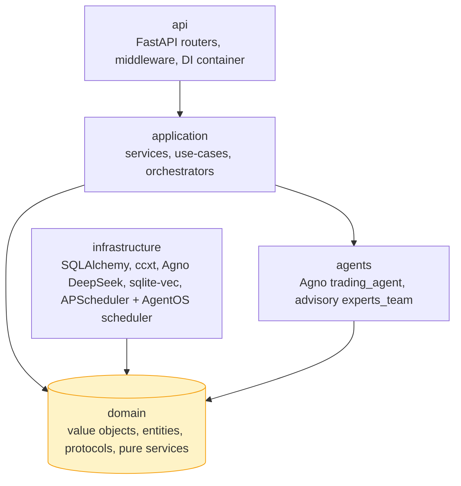
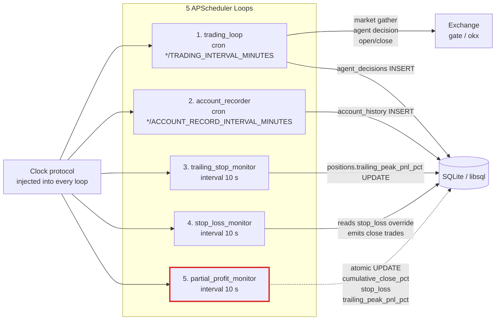
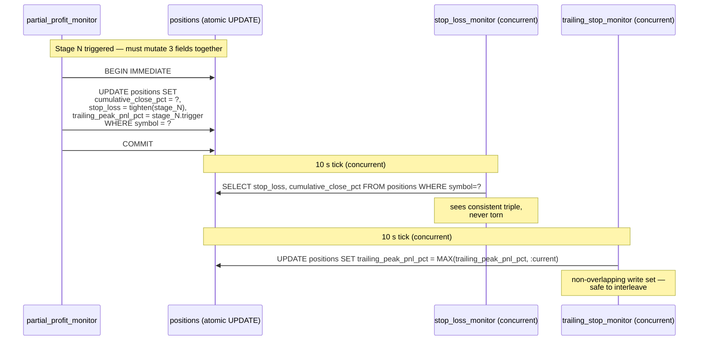
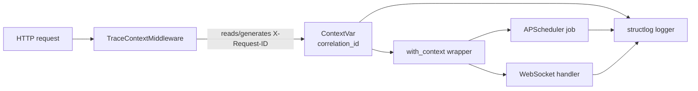

<p align="right">
  <b>English</b> | <a href="./ARCHITECTURE_ZH.md">简体中文</a>
</p>

# OmniTrade — Architecture

> Python 3.11 DDD backend + Next.js 14 dashboard. This doc is the source of truth for the layer contract, scheduler topology, three-way state invariant, observability surface, and test strategy.

---

## 1. DDD 4-layer overview

OmniTrade follows a classic Domain-Driven Design layering. Each layer has a single direction of allowed imports:



### Layer rules

| Layer | May import from | Must NOT import from |
|---|---|---|
| `domain/` | Python stdlib, `pydantic`, `typing` | anything in `infrastructure/`, `api/`, `application/` |
| `infrastructure/` | `domain/`, external libs (`sqlalchemy`, `ccxt`, `agno`, `httpx`) | `application/`, `api/` |
| `application/` | `domain/`, `agents/`, `infrastructure/` via protocols | `api/` |
| `api/` | `application/`, `domain/` DTOs | `infrastructure/` direct |
| `agents/` | `domain/`, `application/` DTOs, **`agno` (Agent / Team / model classes)** | `infrastructure/` direct |

### Monitor Waiver (ADR)

> **Decision (from consensus plan §P1):** the five APScheduler monitors (`trading`, `account`, `trailing_stop`, `stop_loss`, `partial_profit`) are allowed to compose `domain/` **and** `infrastructure/` directly.

**Rationale** — the three-way state contract (below) requires a single atomic SQL `UPDATE` inside the partial-profit monitor. Forcing the monitor through an application service layer would serialize it via repository interfaces and defeat the atomicity guarantee. The waiver is scoped to `apps/backend/src/omnitrade/application/monitors/*.py`; no other module outside `application/` is allowed to bypass layers.

---

## 2. Five-loop scheduler

All loops are launched by `application/bootstrap.py` via APScheduler's `AsyncIOScheduler`. A **single injected `Clock` protocol** lets tests fast-forward time without touching wall-clock time.



**Invariants to preserve:**

- Start order matches upstream: trading → account → trailing → stop-loss → partial-profit.
- The **three 10 s monitors run concurrently**; only `partial_profit_monitor` performs the three-way UPDATE, and it must use `BEGIN IMMEDIATE` (SQLite) or `SELECT ... FOR UPDATE` (Postgres-compatible dialects) to prevent torn reads in the other two monitors.
- `Clock` is the only non-deterministic input; replace with `FakeClock` in tests.

---

## 3. Three-way state contract

Three columns on the `positions` table must be mutated together:

| field | written by | read by | semantics |
|---|---|---|---|
| `cumulative_close_pct` | `partial_profit_monitor` | `stop_loss_monitor`, prompt renderer | cumulative % of original qty already closed (0–100) |
| `stop_loss` | `partial_profit_monitor` (tightening after each stage) | `stop_loss_monitor.get_stop_loss_threshold()`, prompt renderer | override % threshold; when non-null, replaces strategy leverage band |
| `trailing_peak_pnl_pct` | `trailing_stop_monitor` (lifts on new high), `partial_profit_monitor` (reset to stage trigger) | trailing evaluator, prompt renderer | highest levered PnL % observed since entry |



**Why atomic matters:** if `partial_profit_monitor` split the UPDATE into three statements, the stop-loss monitor could read a freshly tightened `stop_loss` while `cumulative_close_pct` still shows the stale value — fabricating a spurious stop-loss trigger.

The invariant is encoded in `domain/services/three_way_state.py::apply_three_way_state` (pure function) and enforced in `infrastructure/persistence/position_repository.py::apply_partial_close`.

---

## 4. LLM-framework scope constraint

> **Only** `apps/backend/src/omnitrade/agents/` may import `agno`.

`agents/trading_agent.py` is the production think path (Agno Agent +
DeepSeek + MultiMCPTools). `agents/experts_team.py` exposes the
advisory Agno Team for ``arena-raider-squad`` / ``arena-tribunal``.
Everything else — `application/`, `infrastructure/`, `domain/` — is
framework-free Python that communicates via plain Pydantic DTOs. This
keeps:

- The domain layer free of LLM-framework leak.
- The trading loop testable without spinning up Agno or DeepSeek.
- The auxiliary `infrastructure/llm/agno_llm_adapter.py` confined to
  the OpenAI-shaped ``LLMClient`` surface that `InvalidationMonitor`
  still consumes.

---

## 5. Observability

### Correlation ID propagation



- `api/middleware/trace.py::TraceContextMiddleware` reads `X-Request-ID` header (or generates UUID4) and sets a `ContextVar`.
- `infrastructure/logging/context.py::with_context(fn)` wraps any coroutine so that it inherits the current `correlation_id` (used by APScheduler job definitions and WS event handlers).
- All logs are structured via `structlog` and emit `correlation_id`, `phase`, `symbol`, `strategy` automatically.

### Metrics (optional)

- `/metrics` Prometheus endpoint (behind `ENABLE_METRICS=true`).
- Counters: `trades_opened_total`, `trades_closed_total{path="stop_loss|trailing|partial|ai"}`, `llm_requests_total`, `llm_errors_total`.
- Histograms: `llm_response_seconds`, `loop_duration_seconds{loop="..."}`.

---

## 6. Close-path taxonomy

Four mutually exclusive paths plus a `none` bucket. See `domain/services/close_path_classifier.py` for the pure classifier and the truth table encoded there.

| Path | Monitor / caller | Writes |
|---|---|---|
| `stop_loss` | `stop_loss_monitor` | `trades(type=close)`, `agent_decisions(trigger=stop_loss)`, `DELETE positions` |
| `trailing_stop` | `trailing_stop_monitor` (only if strategy `enableCodeLevelProtection=true`) | `trades`, `agent_decisions`, `DELETE positions` |
| `partial_profit` | `partial_profit_monitor` | `trades(partial qty)`, atomic `UPDATE positions` (3-way), `agent_decisions` |
| `ai_decision` | `tools/trade_execution.py::close_position_tool` (AI tool call or UI) | `trades`; relies on reconcile pass |
| `none` | n/a | open-only snapshots |

---

## 6.5 Test Strategy

### Phase 4.5: 22-Cassette Characterization Gate `[SUPERSEDED by Phase 9 PR-B2, see §6.6 below]`

The 22-fixture gate in `apps/backend/tests/behavioral_equivalence/` asserted the Python agent reproduces the frozen **hand-curated contract** at ≥ 0.95 pass rate.

**Why characterization** (see `.omc/plans/phase-8-oracle-spike-report.md` for full evidence):

1. Monitor-initiated closes (`trailing_stop` / `stop_loss` / `partial_profit` — 13 of 22 fixtures) never invoke the LLM by design. No "raw bytes" exist to capture at the LLM boundary.
2. The 9 AI-initiated fixtures carry no provenance metadata (model-id, seed, temperature, captured request/response envelope).
3. Baselines contain human prose, manual arithmetic, and `EDGE CASE` markers — signatures of hand-authored contracts, not captured telemetry.
4. Cassettes are deterministically synthesised by `_cassette_synth.py` from the baseline JSONs; cassette URIs use a sentinel host, not a real provider.

**What the gate guarded:** regression of the Python agent against the frozen hand-curated contract.

**Gate composition** (Phase 8+):
- `pytest -m characterization`: 22 primary fixtures (≥0.95 pass rate).
- `pytest -m expert_parity` (Phase 8.5a onward): multi-agent sub-agent cassettes, independent of the 22/22 gate.

---

## 6.6 Phase 9 PR-B2 Prompt Audit Modernization

PR-B2 (commits a6d2ad7, d6f0853, 96b20a4, Phase D cleanup) retired the 22-cassette gate and replaced it with a three-layer structured test pyramid:

### Structured Output Contract Gate (replaces 22-cassette gate)

28 structured-output contract tests in `tests/agents/test_structured_output_contract.py` assert every decision shape, tool-call schema, and hold/close action type that the refactored prompt can produce. These run in CI without a live LLM key.

### Tool-Aware Gate

`tests/agents/test_tool_aware_gate.py` verifies that `build_hold_tool` is activated (Phase B) and that each scenario selects the correct tool from the registered tool set.

### Drift-Detection Probes

`scripts/pr_b2_phase_a_probe.py` and `scripts/pr_b2_phase_b_probe.py` are runnable locally against a live LLM key to detect prompt/model drift before it reaches CI.

**Why the cassette gate was retired:**

- Phase A prompt rewrite and Phase B `build_hold_tool` activation diverged live LLM responses from the frozen baselines, making the old gate a stale regression target.
- The 28 new structured tests provide a more direct signal aligned with the current prompt contract, without dependency on synthesised cassettes or a specific provider response shape.

**Run the new gate:**

```bash
cd apps/backend
uv run pytest tests/agents/ -q
```

---

## 7. Related documents

| Doc | Purpose |
|---|---|
| [STRATEGIES.md](./STRATEGIES.md) | 11 strategies with parameter tables |
| [RELEASE_CHECKLIST.md](./RELEASE_CHECKLIST.md) | Dry-runnable production release checklist |
| [VCRPY_REFRESH.md](./VCRPY_REFRESH.md) | Retired cassette refresh runbook (historical reference) |
| `docs/history/` | Archived per-phase handoff notes |

---

## 8. Glossary

- **Close path** — how a position exited (`stop_loss`, `trailing_stop`, `partial_profit`, `ai_decision`, `none`).
- **Three-way state contract** — the atomicity invariant on `{cumulative_close_pct, stop_loss, trailing_peak_pnl_pct}`.
- **Monitor** — a 10-second async loop in `application/monitors/` with the waiver to compose infrastructure directly.
- **Jury / Team** — sub-agent sets used by `arena-tribunal` and `arena-raider-squad` strategies respectively.
- **Characterization gate** — retired in PR-B2 Phase D. Was `scripts/run_characterization.py` replaying 22 frozen fixtures against VCR cassettes at threshold 0.95. Replaced by the structured output contract gate in `tests/agents/` (see §6.6).
