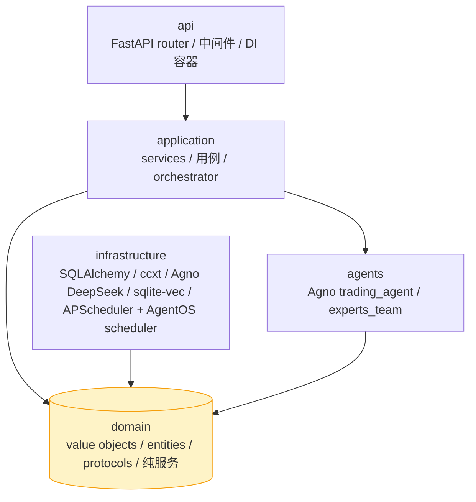
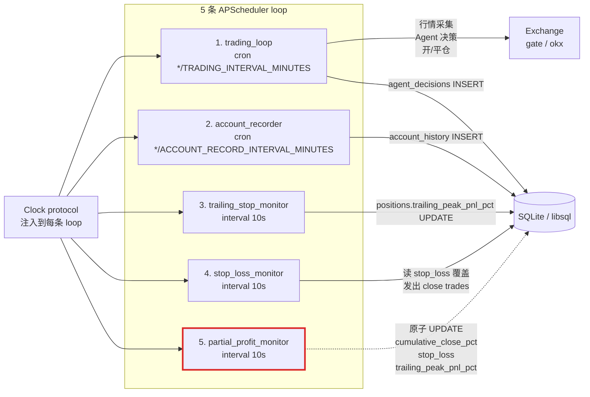
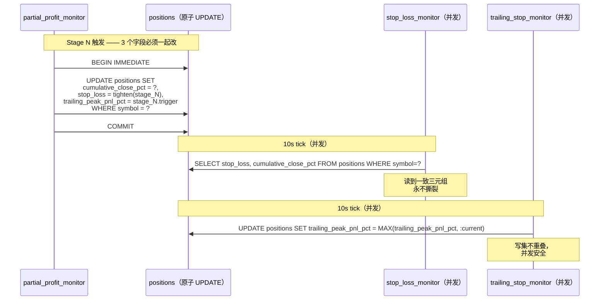
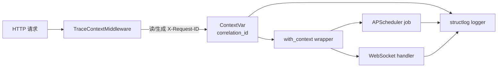

<p align="right">
  <a href="./ARCHITECTURE.md">English</a> | <b>简体中文</b>
</p>

# OmniTrade —— 架构

> Python 3.11 DDD 后端 + Next.js 14 仪表盘。本文档是分层契约、调度拓扑、三位一体状态不变量、可观测性表面、测试策略的唯一事实源。

---

## 1. DDD 4 层概览

OmniTrade 采用经典 Domain-Driven Design 分层。每层只有一个允许的 import 方向：



### 分层规则

| 层 | 可以 import | 禁止 import |
|---|---|---|
| `domain/` | Python 标准库、`pydantic`、`typing` | `infrastructure/`、`api/`、`application/` 下任何内容 |
| `infrastructure/` | `domain/`、外部库（`sqlalchemy`、`ccxt`、`agno`、`httpx`） | `application/`、`api/` |
| `application/` | `domain/`、`agents/`、通过 protocol 调 `infrastructure/` | `api/` |
| `api/` | `application/`、`domain/` DTO | 直接调 `infrastructure/` |
| `agents/` | `domain/`、`application/` DTO、**`agno`（Agent / Team / 模型类）** | 直接调 `infrastructure/` |

### 监控器豁免（ADR）

> **决策（共识计划 §P1）：** 5 条 APScheduler monitor（`trading`、`account`、`trailing_stop`、`stop_loss`、`partial_profit`）允许同时直接组合 `domain/` **和** `infrastructure/`。

**理由** —— 下文三位一体状态契约要求 `partial_profit_monitor` 内部单条原子 SQL `UPDATE`。若强制 monitor 走 application 服务层，会把它串行化到 repository 接口下，破坏原子性保证。该豁免范围严格限定在 `apps/backend/src/omnitrade/application/monitors/*.py`；`application/` 之外的任何模块都不得绕过分层。

---

## 2. 五条 loop 调度

所有 loop 由 `application/bootstrap.py` 通过 APScheduler 的 `AsyncIOScheduler` 启动。**统一注入一个 `Clock` protocol**，让测试可以快进时间而不动系统时钟。



**必须守住的不变量：**

- 启动顺序：trading → account → trailing → stop-loss → partial-profit。
- **三条 10s monitor 并发执行**；只有 `partial_profit_monitor` 做三位一体 UPDATE，必须用 `BEGIN IMMEDIATE`（SQLite）或 `SELECT ... FOR UPDATE`（Postgres 兼容方言），以防另两条 monitor 读到 torn write。
- `Clock` 是唯一非确定性输入；测试里用 `FakeClock` 替换。

---

## 3. 三位一体状态契约

`positions` 表上 3 个字段必须一起改：

| 字段 | 写入方 | 读取方 | 语义 |
|---|---|---|---|
| `cumulative_close_pct` | `partial_profit_monitor` | `stop_loss_monitor`、prompt 渲染 | 累计已平仓比例（0–100） |
| `stop_loss` | `partial_profit_monitor`（每 stage 收紧） | `stop_loss_monitor.get_stop_loss_threshold()`、prompt 渲染 | 覆盖阈值，非 null 时替代策略杠杆带 |
| `trailing_peak_pnl_pct` | `trailing_stop_monitor`（新高时抬升）、`partial_profit_monitor`（重置到 stage trigger） | trailing evaluator、prompt 渲染 | 自入场起观察到的最高杠杆化 PnL % |



**为什么必须原子：** 如果 `partial_profit_monitor` 把 UPDATE 拆成 3 条，`stop_loss_monitor` 可能读到刚收紧的 `stop_loss` 但 `cumulative_close_pct` 还是旧值，造成虚假的 stop-loss 触发。

契约在 `domain/services/three_way_state.py::apply_three_way_state`（纯函数）编码，由 `infrastructure/persistence/position_repository.py::apply_partial_close` 强制执行。

---

## 4. LLM 框架作用域约束

> **只有** `apps/backend/src/omnitrade/agents/` 允许 `import agno`。

`agents/trading_agent.py` 是生产 think 路径（Agno Agent + DeepSeek +
MultiMCPTools）。`agents/experts_team.py` 暴露 `arena-raider-squad` /
`arena-tribunal` 用的咨询 Agno Team。其他模块（`application/`、
`infrastructure/`、`domain/`）都是 framework-free 的 Python，通过普
通 Pydantic DTO 通信。这么做保证：

- Domain 层不会被 LLM 框架污染。
- Trading loop 单测不需要启动 Agno 或 DeepSeek。
- 辅助模块 `infrastructure/llm/agno_llm_adapter.py` 仅暴露
  OpenAI 风格的 `LLMClient` dict 接口，供 `InvalidationMonitor` 等
  消费方继续沿用。

---

## 5. 可观测性

### Correlation ID 传播



- `api/middleware/trace.py::TraceContextMiddleware` 读 `X-Request-ID` 请求头（无则生成 UUID4），写入 `ContextVar`。
- `infrastructure/logging/context.py::with_context(fn)` 包装任意协程，使其继承当前 `correlation_id`（APScheduler job 定义和 WS 事件 handler 用它）。
- 日志全部通过 `structlog` 结构化输出，自动带上 `correlation_id`、`phase`、`symbol`、`strategy`。

### Metrics（可选）

- `/metrics` Prometheus 端点（`ENABLE_METRICS=true` 时开启）。
- Counter：`trades_opened_total`、`trades_closed_total{path="stop_loss|trailing|partial|ai"}`、`llm_requests_total`、`llm_errors_total`。
- Histogram：`llm_response_seconds`、`loop_duration_seconds{loop="..."}`。

---

## 6. Close-path 分类

4 条互斥路径 + 1 个 `none` 桶。纯分类器和真值表见 `domain/services/close_path_classifier.py`。

| Path | 监控器 / 调用方 | 写入 |
|---|---|---|
| `stop_loss` | `stop_loss_monitor` | `trades(type=close)`、`agent_decisions(trigger=stop_loss)`、`DELETE positions` |
| `trailing_stop` | `trailing_stop_monitor`（仅在策略 `enableCodeLevelProtection=true` 时） | `trades`、`agent_decisions`、`DELETE positions` |
| `partial_profit` | `partial_profit_monitor` | `trades`（部分数量）、原子 3-way `UPDATE positions`、`agent_decisions` |
| `ai_decision` | `tools/trade_execution.py::close_position_tool`（AI 工具调用或 UI） | `trades`；依赖 reconcile 回补 |
| `none` | n/a | 只开仓的快照 |

---

## 6.5 测试策略

### Phase 4.5：22-Cassette 行为等价门 `[已被 Phase 9 PR-B2 取代，见下方 §6.6]`

`apps/backend/tests/behavioral_equivalence/` 下的 22-fixture 门断言：Python Agent 对固化的**手工策展契约**复现通过率 ≥ 0.95。

**为什么是 characterization 而不是 byte-exact parity：**

1. Monitor 触发的平仓（`trailing_stop` / `stop_loss` / `partial_profit`，22 份中 13 份）设计上就不调用 LLM；LLM 边界上没有"原始字节"可捕获。
2. 剩下 9 份 AI 触发的 fixture 没有 provenance 元数据（model-id / seed / temperature / 捕获到的请求响应信封）。
3. Baseline 里含人工散文、手工算术、`EDGE CASE` 标记——都是手写契约的特征，不是捕获到的 telemetry。
4. Cassette 由 `_cassette_synth.py` 确定性合成自 baseline JSON；cassette URI 用哨兵主机，不是真实 provider。

**门守住什么：** 回归检测——Python Agent 相对冻结的手工策展契约的回归。

**门的组成（Phase 8+）：**
- `pytest -m characterization`：22 份主 fixture（≥ 0.95 通过率）。
- `pytest -m expert_parity`（8.5a 起）：多智能体子 agent cassette，与 22/22 门独立。

---

## 6.6 Phase 9 PR-B2 Prompt Audit 现代化

PR-B2（commits a6d2ad7、d6f0853、96b20a4、Phase D cleanup）退役了 22-cassette 门，替换为三层结构化测试金字塔：

### 结构化输出契约门（取代 22-cassette 门）

`tests/agents/test_structured_output_contract.py` 中 28 条结构化输出契约测试，断言重写后的 prompt 能产出的所有决策形态、tool-call schema、hold/close action 类型。不需要真实 LLM key 即可在 CI 中运行。

### Tool-Aware Gate

`tests/agents/test_tool_aware_gate.py` 验证 `build_hold_tool` 已激活（Phase B），以及各场景从注册工具集中选择了正确的工具。

### 漂移检测探针

`scripts/pr_b2_phase_a_probe.py` 和 `scripts/pr_b2_phase_b_probe.py` 可在本地对真实 LLM key 运行，在漂移到达 CI 前提前发现 prompt/模型漂移。

**为什么退役 cassette 门：**

- Phase A prompt 重写和 Phase B `build_hold_tool` 激活后，真实 LLM 响应已与冻结 baseline 分道扬镳，旧门成了陈旧的回归目标。
- 28 条新结构化测试提供了与当前 prompt 契约对齐的更直接信号，不依赖合成 cassette 或特定 provider 响应形态。

**运行新的门：**

```bash
cd apps/backend
uv run pytest tests/agents/ -q
```

---

## 7. 相关文档

| 文档 | 用途 |
|---|---|
| [STRATEGIES_ZH.md](./STRATEGIES_ZH.md) | 11 套策略的参数表 |
| [RELEASE_CHECKLIST_ZH.md](./RELEASE_CHECKLIST_ZH.md) | 可 dry-run 的生产发布清单 |
| [VCRPY_REFRESH_ZH.md](./VCRPY_REFRESH_ZH.md) | 已退役的 cassette 刷新 runbook（历史参考） |
| `docs/history/` | 归档的分阶段 HANDOFF 记录 |

---

## 8. 术语表

- **Close path** —— 仓位退出方式（`stop_loss`、`trailing_stop`、`partial_profit`、`ai_decision`、`none`）。
- **三位一体状态契约** —— `{cumulative_close_pct, stop_loss, trailing_peak_pnl_pct}` 的原子性不变量。
- **Monitor** —— `application/monitors/` 下的 10 秒异步 loop，享有直接组合 infrastructure 的豁免。
- **Jury / Team** —— `arena-tribunal` 和 `arena-raider-squad` 策略分别使用的子 Agent 集。
- **行为等价门** —— 已在 PR-B2 Phase D 退役。原为 `scripts/run_characterization.py` 以阈值 0.95 对 22 份固化 fixture 做 VCR cassette 重放。已由 `tests/agents/` 下的结构化输出契约门取代（见 §6.6）。
